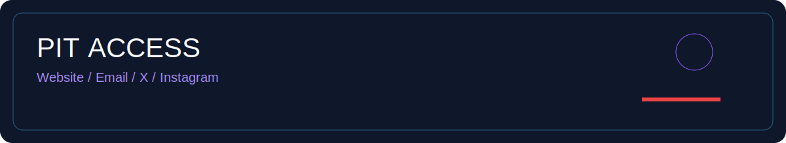
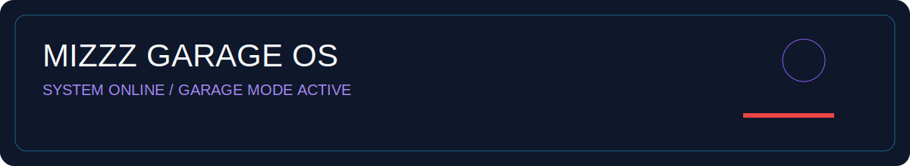
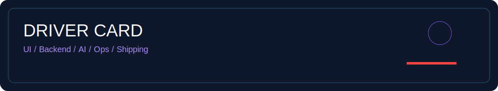
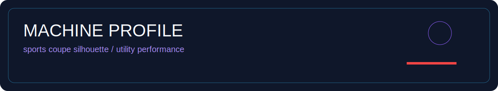
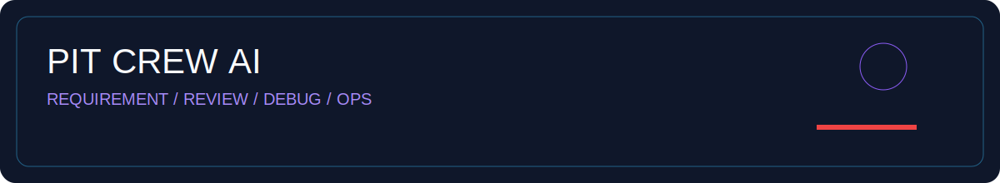
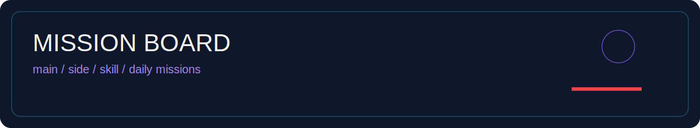
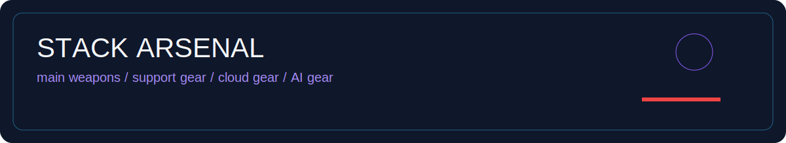
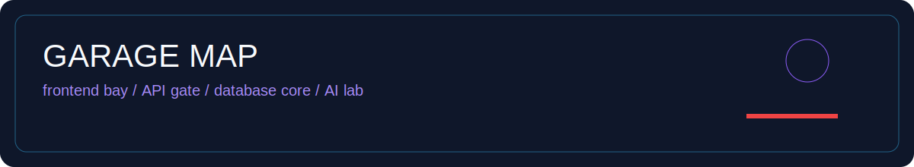
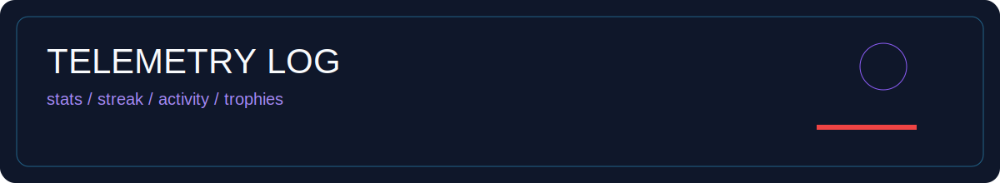
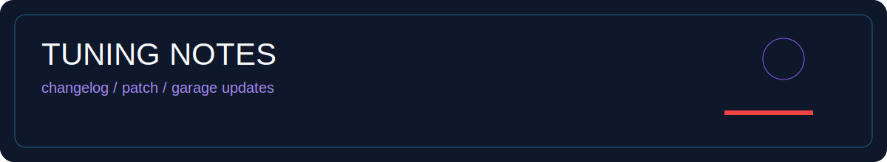

  

## Identity

  <strong>mizzz</strong> ・ Product Builder ・ Frontend-focused Full Stack ・ AI Native Developer 
  Build small. Polish fast. Operate safely.

## Pit Access

  

  
  
  
  

Open pit access for product UI, small builds, automation, and AI-native development.

## Mizzz Garage OS

| Module | State |
|---|---|
| Product UI | Online |
| Full Stack Foundation | Online |
| AI Native Workflow | Online |
| Garage Lineup | Expanding |
| Pit Access | Open |
| Telemetry | Streaming |

## Driver Card

| Label | Value |
|---|---|
| Driver | mizzz |
| Class | Product Builder |
| Role | Frontend-focused Full Stack |
| Trait | AI Native Developer |
| Main Route | UI / API / DB / Worker / Bot |
| Drive Style | Build small, polish fast, operate safely |

## Machine Profile

| Spec | Build Metaphor |
|---|---|
| Platform | Cyber Garage Build |
| Body Type | Product Builder |
| Engine | AI Native Workflow |
| Transmission | Full Stack Delivery |
| Drive System | UI-first Engineering |
| Fuel | Curiosity + Iteration |
| Mode | Track / Street / Utility |

## Pit Crew AI

AIを実装代行ではなく、要件整理・設計レビュー・デバッグ・運用整理に組み込む、開発のピットクルーとして活用しています。

- Requirement Design
- Architecture Review
- Debugging Support
- Operation Notes
- README / PR Drafting

## Mission Board

<table>
  <tr><td><strong>Main Mission</strong></td><td>Product UI</td></tr>
  <tr><td><strong>Side Mission</strong></td><td>Full Stack Foundation</td></tr>
  <tr><td><strong>Skill Mission</strong></td><td>AI Native Development</td></tr>
  <tr><td><strong>Daily Mission</strong></td><td>Small Product Shipping</td></tr>
  <tr><td><strong>Support Mission</strong></td><td>Work With Me</td></tr>
</table>

## Garage Lineup

ガレージに並ぶプロダクトログ。小さな試作から運用を意識した基盤まで、走らせながら改善しています。

<table>
  <tr><td width="50%"><h3><a href="https://github.com/mizzz-dev/lunaria">lunaria</a></h3>
<strong>Class:</strong> Community Ops ・ <strong>Status:</strong> Active Build
</td><td width="50%"><h3><a href="https://github.com/mizzz-dev/quizverse">quizverse</a></h3>
<strong>Class:</strong> Interactive Learning ・ <strong>Status:</strong> Active Build
</td></tr>
  <tr><td width="50%"><h3><a href="https://github.com/mizzz-dev/RouteGarage">RouteGarage</a></h3>
<strong>Class:</strong> Utility Platform ・ <strong>Status:</strong> Building
</td><td width="50%"><h3><a href="https://github.com/mizzz-dev/NTE-Build-Score-Calculator">NTE-Build-Score-Calculator</a></h3>
<strong>Class:</strong> Build Utility ・ <strong>Status:</strong> Released
</td></tr>
  <tr><td width="50%"><h3><a href="https://github.com/mizzz-dev/mealwise">mealwise</a></h3>
<strong>Class:</strong> Lifestyle App ・ <strong>Status:</strong> Active Build
</td><td width="50%"></td></tr>
</table>

## Stack Arsenal

- **Main Weapons**（現在の主力）: React / Next.js / Nuxt.js / TypeScript / JavaScript / Tailwind CSS / Vite
- **Support Gear**（補助技術）: Flutter / Unreal Engine 5 / C / C# / C++ / Node.js / Fastify / Python / FastAPI / Go / PostgreSQL / Redis / Docker / GitHub Actions
- **Cloud Gear**（配備先）: Cloudflare / GCP / AWS / Azure / Vercel / Railway / Render
- **AI Gear**（開発支援システム）: AI Native Development / LLM-assisted Development / Automation / Requirement Design / Design Review / Debugging / Operation Design

## Garage Map

Frontend Bay / API Gate / Database Core / Worker Lane / Bot Station / AI Lab / Cloud Port / Game Zone / Garage Hub

## Work With Me

小さく作って、運用できる形まで整える実装パートナーとして伴走します。UI改善、機能追加、設計整理、Bot連携、ダッシュボード構築、AIを使った要件整理・レビュー支援まで、今あるものを活かしながら一段使いやすくします。

## Telemetry Log

  
  

## Contribution Flow

  <picture>
    <source media="(prefers-color-scheme: dark)" srcset="https://raw.githubusercontent.com/mizzz-dev/mizzz-dev/output/github-snake-dark.svg" />
    <source media="(prefers-color-scheme: light)" srcset="https://raw.githubusercontent.com/mizzz-dev/mizzz-dev/output/github-snake.svg" />
    
  </picture>

## Now Playing
夜のガレージやドライブのBGMとして流れているログ。

## Tuning Notes

- v3.0: サイバーガレージ風プロフィールUIへ進化
- v3.1: Pit Accessを追加
- v3.2: Garage Lineupを強化
- v3.3: Pit Crew AIを追加
- v3.4: スポーツカー / SUVインスパイアの世界観を追加

## Links / Contact

  
  
  
  
  
  
  

