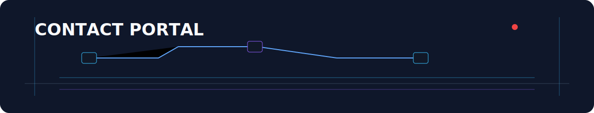
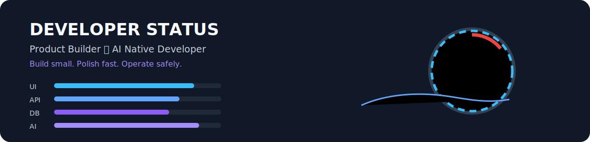
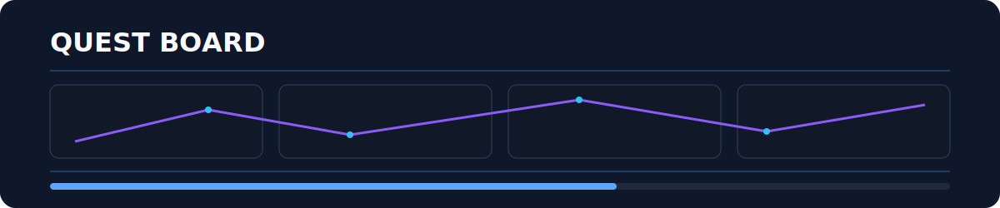
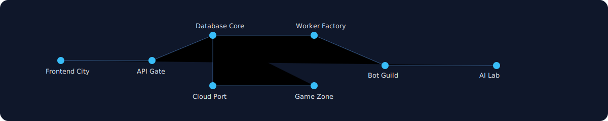
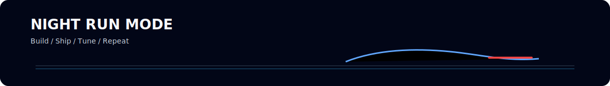
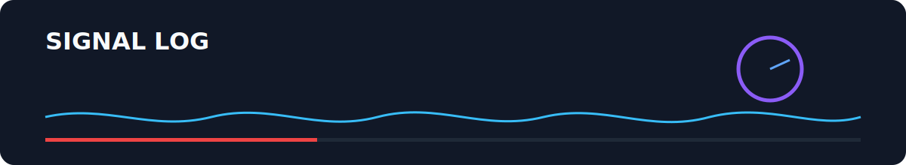
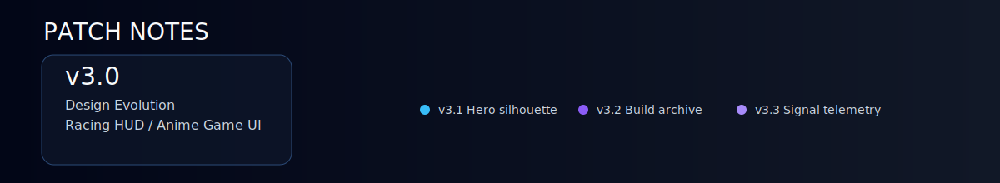

## Hero

  

## Identity

  <strong>mizzz</strong> ・ Product Builder ・ Frontend-focused Full Stack ・ AI Native Developer 
  Build small. Polish fast. Operate safely.

UI / API / DB / Worker / Bot / AI をつなぎ、実装から運用まで一気通貫で整える開発スタイルを実践しています。 
見た目の体験設計と、現場で使える実務性を両立することを重視しています。

## Contact Portal

  

  
  
  
  

## Developer Status

  

<table>
  <tr><td><strong>Class</strong></td><td>Product Builder</td></tr>
  <tr><td><strong>Role</strong></td><td>Frontend-focused Full Stack</td></tr>
  <tr><td><strong>Trait</strong></td><td>AI Native Developer</td></tr>
  <tr><td><strong>Main Quest</strong></td><td>Small Product Shipping</td></tr>
  <tr><td><strong>Sub Quest</strong></td><td>UI / API / DB / Worker / Bot</td></tr>
  <tr><td><strong>Style</strong></td><td>Build small, polish fast, operate safely</td></tr>
</table>

## Quest Board

  

<table>
  <tr>
    <td width="50%" valign="top"><h3>Main Quest: Product UI</h3>
<strong>Status:</strong> Active ・ <strong>Track:</strong> Frontend

React / Next.js / TypeScript で、使いやすい画面と導線を設計します。
</td>
    <td width="50%" valign="top"><h3>Side Quest: Full Stack Foundation</h3>
<strong>Status:</strong> Active ・ <strong>Track:</strong> Full Stack

API・DB・Worker・Bot をつなげて、運用できる形まで整えます。
</td>
  </tr>
  <tr>
    <td width="50%" valign="top"><h3>Skill Quest: AI Native Development</h3>
<strong>Status:</strong> Active ・ <strong>Focus:</strong> AI Workflow

AIを要件整理・設計レビュー・デバッグ・運用整理に組み込みます。
</td>
    <td width="50%" valign="top"><h3>Daily Quest: Small Product Shipping</h3>
<strong>Status:</strong> Daily ・ <strong>Focus:</strong> Ship & Improve

小さく作って、改善しながら使える形に育てます。
</td>
  </tr>
</table>

## Build Archive

<table>
  <tr><td width="50%"><h3><a href="https://github.com/mizzz-dev/lunaria">lunaria</a></h3>
<strong>Archive ID:</strong> 001 ・ <strong>Class:</strong> Community Ops ・ <strong>Status:</strong> Active Build

Discordコミュニティ運営を、Bot・管理ダッシュボード・API・Workerで支える運用プラットフォーム。
</td><td width="50%"><h3><a href="https://github.com/mizzz-dev/quizverse">quizverse</a></h3>
<strong>Archive ID:</strong> 002 ・ <strong>Class:</strong> Interactive Learning ・ <strong>Status:</strong> Active Build

クイズ作成・プレイ・ランキングを中心に、学習と参加導線をつなぐインタラクティブWebプロダクト。
</td></tr>
  <tr><td width="50%"><h3><a href="https://github.com/mizzz-dev/RouteGarage">RouteGarage</a></h3>
<strong>Archive ID:</strong> 003 ・ <strong>Class:</strong> Utility Platform ・ <strong>Status:</strong> Building

ドライブ記録・ルート整理・スポット共有・愛車管理を一体化するプロダクト構想。
</td><td width="50%"><h3><a href="https://github.com/mizzz-dev/NTE-Build-Score-Calculator">NTE-Build-Score-Calculator</a></h3>
<strong>Archive ID:</strong> 004 ・ <strong>Class:</strong> Build Utility ・ <strong>Status:</strong> Released

ゲーム内ビルドのスコア確認を支援するWebアプリ。
</td></tr>
  <tr><td width="50%"><h3><a href="https://github.com/mizzz-dev/mealwise">mealwise</a></h3>
<strong>Archive ID:</strong> 005 ・ <strong>Class:</strong> Lifestyle App ・ <strong>Status:</strong> Active Build

予算内での食事計画・買い物・価格記録をつなぐライフスタイル系Webアプリ。
</td><td width="50%"></td></tr>
</table>

## Stack Arsenal

- **Main Weapons**: React / Next.js / TypeScript / JavaScript / Tailwind CSS / Vite
- **Support Gear**: Node.js / Fastify / Python / FastAPI / Go / PostgreSQL / Redis / Docker / GitHub Actions
- **Cloud Gear**: Cloudflare / GCP / AWS / Azure / Vercel / Railway / Render
- **Experimental Gear**: Nuxt.js / Flutter / Unreal Engine 5 / C / C# / C++
- **AI Gear**: AI Native Development / LLM-assisted Development / Automation / Requirement Design / Design Review / Debugging / Operation Design

  

  
  
  
  
  

## World Map

## Work With Me

ピット作業のように、今あるものを点検し、必要なところから小さく改善します。
UI改善、機能追加、設計整理、Bot連携、ダッシュボード構築、AIを使った要件整理・レビュー支援まで、
走れる状態に整えてから継続的にチューニングする実装パートナーとして伴走します。

## Signal Log

  
  

## Contribution Flow

日々のコミットログを、走行ラインのように可視化しています。

  <picture>
    <source media="(prefers-color-scheme: dark)" srcset="https://raw.githubusercontent.com/mizzz-dev/mizzz-dev/output/github-snake-dark.svg" />
    <source media="(prefers-color-scheme: light)" srcset="https://raw.githubusercontent.com/mizzz-dev/mizzz-dev/output/github-snake.svg" />
    
  </picture>

## Now Playing

Night garage / coding / drive mode のBGMログ。

  

## Patch Notes

- v3.0: Cyber Anime Racing HUDへデザイン進化
- v3.1: Heroにスポーツカー風シルエットを追加
- v3.2: Build Archiveをガレージベイ風に強化
- v3.3: Signal Logにテレメトリー感を追加
- v3.4: World Mapにナイトラン風ルートを追加

## Links / Contact

  
  
  
  
  
  
  

