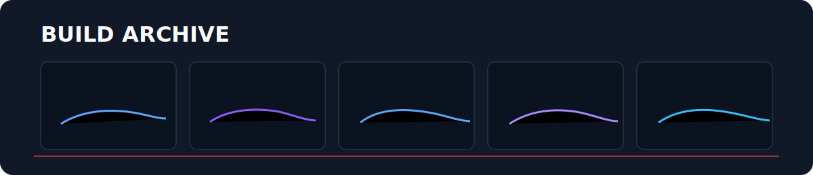
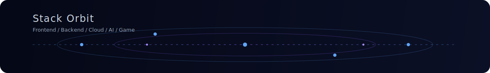

<!--
  ==========================================================
  GitHub Profile README - mizzz-dev
  作品ページのような見た目と、実際の開発レンジが伝わる情報設計を両立する
  ==========================================================
-->

  

  <strong>mizzz</strong> 
  Product Builder / Frontend-focused Full Stack Developer / AI Native Developer

  UI起点でプロダクトを形にし、API・DB・Worker・Botまでつなげて運用できる形に整えます。 
  AIを要件整理・設計レビュー・デバッグ・運用整理に組み込む開発スタイルを実践しています。

  

## Current Focus

<table>
  <tr>
    <td width="50%" valign="top">
      <h3>Product UI</h3>
      
React / Next.js / TypeScript で、使いやすい画面と導線を設計します。

    </td>
    <td width="50%" valign="top">
      <h3>Full Stack Foundation</h3>
      
API・DB・Worker・Bot をつなげて、運用できる形まで整えます。

    </td>
  </tr>
  <tr>
    <td width="50%" valign="top">
      <h3>AI Native Development</h3>
      
AIを要件整理・設計レビュー・デバッグ・運用整理に組み込みます。

    </td>
    <td width="50%" valign="top">
      <h3>Small Product Shipping</h3>
      
小さく作って、改善しながら使える形に育てます。

    </td>
  </tr>
</table>

  

## Featured Builds

  

<table>
  <tr>
    <td width="50%">
      <h3><a href="https://github.com/mizzz-dev/lunaria">lunaria</a></h3>
      
<strong>Community Operations Platform</strong>

      
Discordコミュニティ運営を、Bot・管理ダッシュボード・API・Workerで支える運用プラットフォーム。ルールエンジン、プラグイン、RBAC、監査ログまで含めて、日々のオペレーションをプロダクトとして扱う構成。

      

        
        
        
        
        
        
        
        
        
      

    </td>
    <td width="50%">
      <h3><a href="https://github.com/mizzz-dev/quizverse">quizverse</a></h3>
      
<strong>Interactive Quiz Experience</strong>

      
クイズ作成・プレイ・ランキングを中心に、学習と参加導線をつなぐインタラクティブWebプロダクト。継続しやすい画面遷移と、参加したくなる体験設計を重視。

      

        
        
        
        
        
        
        
      

    </td>
  </tr>
  <tr>
    <td width="50%">
      <h3><a href="https://github.com/mizzz-dev/RouteGarage">RouteGarage</a></h3>
      
<strong>Drive Planning & Community Utility</strong>

      
ドライブ記録・ルート整理・スポット共有・愛車管理を一体化するプロダクト構想。route / planning / utility を軸に、日常の移動体験を整理しやすくする設計。

      

        
        
        
        
        
      

    </td>
    <td width="50%">
      <h3><a href="https://github.com/mizzz-dev/NTE-Build-Score-Calculator">NTE-Build-Score-Calculator</a></h3>
      
<strong>Build Score Utility</strong>

      
ゲーム内ビルドのスコア確認を支援するWebアプリ。入力・計算・確認の流れを短くし、継続運用しやすいUIとテストを重視。

      

        
        
        
        
        
      

    </td>
  </tr>
  <tr>
    <td width="50%">
      <h3><a href="https://github.com/mizzz-dev/mealwise">mealwise</a></h3>
      
<strong>Daily Meal Planning App</strong>

      
予算内での食事計画・買い物・価格記録をつなぐライフスタイル系Webアプリ。日常で使いやすい入力導線と、続けやすい小さなプロダクト体験を重視。

      

        
        
        
        
        
      

    </td>
    <td width="50%"></td>
  </tr>
</table>

  

## Stack / Engineering Range

  

### Core Stack

  

### Product Range

  

  
  

### Cloud / Deploy

  

  
  
  
  
  
  
  

- **Experience Range Policy**: Core Stack は現在の主力、Product Range は public / private / archived を含む経験レンジ、Cloud / AI / Workflow は運用と開発スタイルを示しています。

  

## Work With Me

小さく作って、運用できる形まで整える実装パートナーとして伴走します。  
UI改善、機能追加、設計整理、Bot連携、ダッシュボード構築など、今あるものを活かしながら一段使いやすくする開発が得意です。

- LP / コーポレートサイト
- WebアプリUI実装
- ダッシュボード
- Discord Bot
- 小規模SaaS / 管理画面
- 既存プロダクト改善
- AIを使った要件整理・設計レビュー・デバッグ支援

  

## GitHub Signal

  
  

  

  

  

  

## Contribution Flow

  <picture>
    <source media="(prefers-color-scheme: dark)" srcset="https://raw.githubusercontent.com/mizzz-dev/mizzz-dev/output/github-snake-dark.svg" />
    <source media="(prefers-color-scheme: light)" srcset="https://raw.githubusercontent.com/mizzz-dev/mizzz-dev/output/github-snake.svg" />
    
  </picture>

  

## Listening

  

  

## Links / Contact

  
  
  
  
  
  
  

