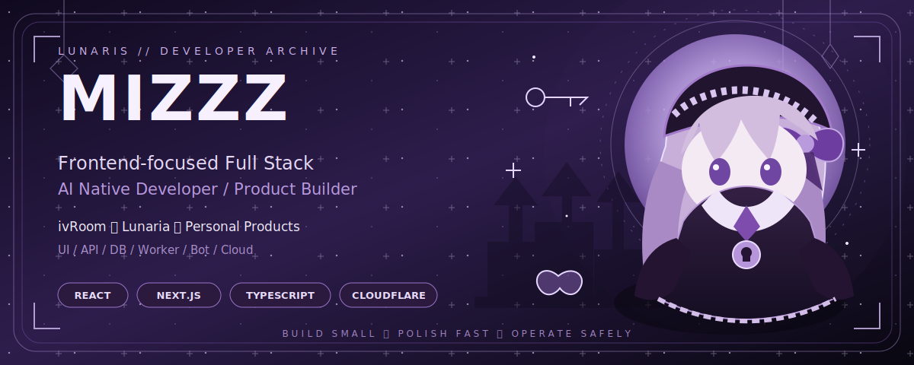
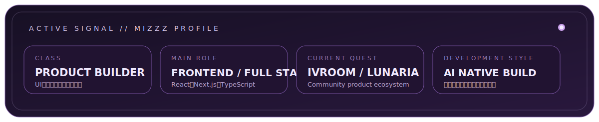
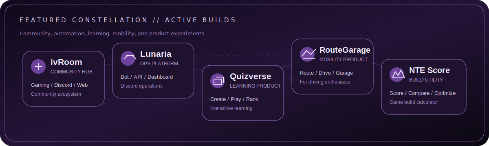

<p align="center">
  
</p>

<p align="center">
  <a href="https://mizzz.jp"></a>
  <a href="https://ivrm.jp"></a>
  <a href="https://x.com/mizzzjp"></a>
  <a href="mailto:contact@mizzz.jp"></a>
</p>

<p align="center">
  <strong>mizzz（ずーみー）</strong><br/>
  Frontend-focused Full Stack Developer / Product Builder / AI Native Developer
</p>

<p align="center">
  React・Next.js・TypeScriptを軸に、UI、API、DB、Worker、Bot、Cloudをつなぎ、<br/>
  アイデアを「実際に使えて、継続運用できるプロダクト」へ育てています。
</p>

<p align="center"></p>

## Developer Archive

<p align="center">
  
</p>

<table>
  <tr>
    <td width="50%" valign="top">
      <h3>🌙 What I Build</h3>
      <p>使いやすいWeb UI、コミュニティ運営基盤、Discord Bot、業務支援ツール、ゲーム関連ユーティリティを中心に開発しています。</p>
    </td>
    <td width="50%" valign="top">
      <h3>🗝️ How I Build</h3>
      <p>小さく作り、早く検証し、安全に改善する方針です。AIを要件整理、実装、レビュー、デバッグ、ドキュメント整備へ組み込んでいます。</p>
    </td>
  </tr>
  <tr>
    <td width="50%" valign="top">
      <h3>🦋 Current Focus</h3>
      <p>フロントエンドの体験品質を主軸に、バックエンド・インフラ・運用設計まで扱える実装力を強化しています。</p>
    </td>
    <td width="50%" valign="top">
      <h3>🔮 Design Direction</h3>
      <p>ダーク、紫、月、星、ゴシック、ゲームUIの空気感を取り入れつつ、視認性と実用性を崩さないデザインを好みます。</p>
    </td>
  </tr>
</table>

<p align="center"></p>

## Featured Constellation

<p align="center">
  
</p>

<table>
  <tr>
    <td width="50%" valign="top">
      <h3><a href="https://ivrm.jp">ivRoom</a></h3>
      <p><strong>Community Ecosystem</strong></p>
      <p>ゲーム、雑談、配信、創作、勉強会をつなぐDiscordコミュニティ。Webサイト、Bot、Minecraft、運営基盤を横断して整備しています。</p>
      <p><code>Next.js</code> <code>TypeScript</code> <code>Cloudflare</code> <code>Discord</code></p>
    </td>
    <td width="50%" valign="top">
      <h3><a href="https://github.com/mizzz-dev/Lunaria">Lunaria</a></h3>
      <p><strong>Discord Community Operations Platform</strong></p>
      <p>Bot、管理ダッシュボード、API、Worker、RBAC、監査ログ、ルールエンジンを統合するコミュニティ運営プラットフォーム。</p>
      <p><code>TypeScript</code> <code>Discord.js</code> <code>PostgreSQL</code> <code>Redis</code></p>
    </td>
  </tr>
  <tr>
    <td width="50%" valign="top">
      <h3><a href="https://github.com/mizzz-dev/quizverse">Quizverse</a></h3>
      <p><strong>Interactive Learning Product</strong></p>
      <p>クイズの作成、プレイ、ランキングを通して、学習と参加体験をつなぐインタラクティブWebプロダクト。</p>
      <p><code>React</code> <code>TypeScript</code> <code>Web Product</code></p>
    </td>
    <td width="50%" valign="top">
      <h3><a href="https://github.com/mizzz-dev/RouteGarage">RouteGarage</a></h3>
      <p><strong>Mobility & Drive Platform</strong></p>
      <p>ルート案内、走行記録、スポット共有、愛車管理をまとめる、日本のドライブユーザー向けプロダクト構想。</p>
      <p><code>Next.js</code> <code>TypeScript</code> <code>Location</code> <code>Privacy</code></p>
    </td>
  </tr>
  <tr>
    <td width="50%" valign="top">
      <h3><a href="https://github.com/mizzz-dev/NTE-Build-Score-Calculator">NTE Build Score Calculator</a></h3>
      <p><strong>Game Build Utility</strong></p>
      <p>ゲーム内ビルドのスコア確認、比較、最適化を支援するダークネオン基調の非公式ファンツール。</p>
      <p><code>Next.js</code> <code>Supabase</code> <code>Design System</code></p>
    </td>
    <td width="50%" valign="top">
      <h3><a href="https://github.com/mizzz-dev/mealwise">Mealwise</a></h3>
      <p><strong>Lifestyle Planning App</strong></p>
      <p>予算内での献立、買い物、価格記録をつなぎ、毎日の食事管理を支えるライフスタイルアプリ。</p>
      <p><code>Product Design</code> <code>Web App</code> <code>Planning</code></p>
    </td>
  </tr>
</table>

<details>
  <summary><strong>More experiments and utilities</strong></summary>
  <br/>
  <p>
    <a href="https://github.com/mizzz-dev/vaultsend">VaultSend</a> ・
    <a href="https://github.com/mizzz-dev/site-sentry-go">Site Sentry Go</a> ・
    <a href="https://github.com/mizzz-dev/stackpilot">StackPilot</a> ・
    <a href="https://github.com/mizzz-dev/log-scope">Log Scope</a> ・
    <a href="https://github.com/mizzz-dev/home-panel-py">Home Panel</a> ・
    <a href="https://github.com/mizzz-dev/ai-code-dojo">AI Code Dojo</a>
  </p>
</details>

<p align="center"></p>

## Stack Arsenal

<p align="center">
  
</p>

<table>
  <tr>
    <td><strong>Frontend</strong></td>
    <td>React / Next.js / TypeScript / JavaScript / Tailwind CSS / Vite</td>
  </tr>
  <tr>
    <td><strong>Backend</strong></td>
    <td>Node.js / Fastify / Python / FastAPI / Go</td>
  </tr>
  <tr>
    <td><strong>Data & Runtime</strong></td>
    <td>PostgreSQL / Redis / Docker / GitHub Actions</td>
  </tr>
  <tr>
    <td><strong>Cloud</strong></td>
    <td>Cloudflare / GCP / AWS / Azure / Vercel / Railway / Render</td>
  </tr>
  <tr>
    <td><strong>Exploration</strong></td>
    <td>Nuxt / Flutter / Unreal Engine / C / C# / C++</td>
  </tr>
</table>

<p align="center">
  
  
  
  
</p>

<p align="center"></p>

## Build Principles

```text
01. Build small        — 最初から巨大化させず、価値の中心から実装する
02. Polish fast        — 実際に触りながら、UIと導線を素早く磨く
03. Operate safely     — セキュリティ、権限、ログ、復旧を設計に含める
04. Document decisions — 重要判断をREADME、Issue、ADR、作業ログに残す
05. AI with review     — AIを活用しつつ、最終判断と品質責任は人間が持つ
```

<p align="center"></p>

## Signal Log

<p align="center">
  
  
</p>

<p align="center">
  
</p>

<p align="center">
  <picture>
    <source media="(prefers-color-scheme: dark)" srcset="https://raw.githubusercontent.com/mizzz-dev/mizzz-dev/output/github-snake-dark.svg" />
    <source media="(prefers-color-scheme: light)" srcset="https://raw.githubusercontent.com/mizzz-dev/mizzz-dev/output/github-snake.svg" />
    
  </picture>
</p>

<p align="center"></p>

## Open Channel

<p align="center">
  UI改善、Webアプリ開発、Discord Bot、コミュニティ基盤、AI活用開発、個人プロジェクトについて発信しています。
</p>

<p align="center">
  <a href="https://mizzz.jp"></a>
  <a href="https://ivrm.jp"></a>
  <a href="https://github.com/mizzz-dev"></a>
  <a href="mailto:contact@mizzz.jp"></a>
</p>

<p align="center">
  <sub>Designed as an original lunar-gothic developer archive for mizzz.</sub>
</p>
