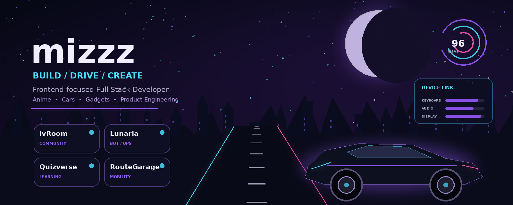
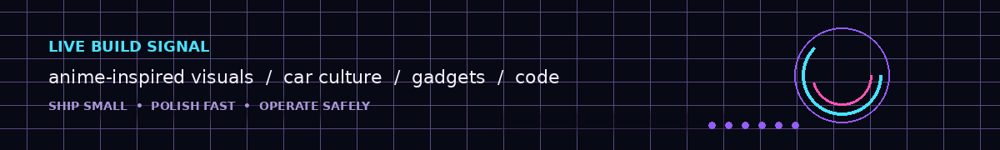

<p align="center">
  
</p>

<p align="center">
  <a href="https://mizzz.jp"></a>
  <a href="https://ivrm.jp"></a>
  <a href="https://x.com/mizzzjp"></a>
  <a href="mailto:contact@mizzz.jp"></a>
</p>

<h1 align="center">mizzz（ずーみー）</h1>

<p align="center">
  <strong>Frontend-focused Full Stack Developer / Product Builder</strong><br/>
  React・Next.js・TypeScriptを軸に、UIからAPI、DB、Bot、Cloud、運用までつなげて実装しています。
</p>

<p align="center">
  アニメの画づくり、車の機能美、ガジェットの精密さが好きです。<br/>
  特定のキャラクター設定に寄せず、好きなカルチャーと技術をプロダクトの体験へ落とし込みます。
</p>

<p align="center">
  
</p>

---

## Current Mode

<table>
  <tr>
    <td width="25%" align="center"><strong>FRONTEND</strong><br/><sub>UI / UX / Motion</sub></td>
    <td width="25%" align="center"><strong>FULL STACK</strong><br/><sub>API / DB / Worker</sub></td>
    <td width="25%" align="center"><strong>COMMUNITY</strong><br/><sub>Discord / Bot / Ops</sub></td>
    <td width="25%" align="center"><strong>AI NATIVE</strong><br/><sub>Design / Build / Review</sub></td>
  </tr>
</table>

- **Build:** アイデアを、触れて試せるWebプロダクトへ変える
- **Polish:** 見た目だけでなく、導線・速度・レスポンシブ・操作感まで磨く
- **Operate:** 権限、ログ、監視、復旧、ドキュメントを実装の一部として扱う
- **Explore:** アニメ、車、ガジェットから得た質感や機能美をUIへ取り入れる

---

## Featured Builds

<table>
  <tr>
    <td width="50%" valign="top">
      <h3><a href="https://ivrm.jp">ivRoom</a></h3>
      <p><strong>Gaming Community Ecosystem</strong></p>
      <p>ゲーム、雑談、配信、創作、勉強会をつなぐコミュニティ。Webサイト、Discord、Minecraft、運営基盤を横断して整備しています。</p>
      <p><code>Next.js</code> <code>TypeScript</code> <code>Cloudflare</code> <code>Discord</code></p>
    </td>
    <td width="50%" valign="top">
      <h3><a href="https://github.com/mizzz-dev/Lunaria">Lunaria</a></h3>
      <p><strong>Discord Community Operations Platform</strong></p>
      <p>Bot、管理ダッシュボード、API、Worker、RBAC、監査ログ、ルールエンジンを統合するコミュニティ運営基盤です。</p>
      <p><code>TypeScript</code> <code>Discord.js</code> <code>PostgreSQL</code> <code>Redis</code></p>
    </td>
  </tr>
  <tr>
    <td width="50%" valign="top">
      <h3><a href="https://github.com/mizzz-dev/quizverse">Quizverse</a></h3>
      <p><strong>Interactive Learning Product</strong></p>
      <p>クイズの作成、プレイ、ランキングを通して、学習と参加体験をつなぐインタラクティブWebプロダクトです。</p>
      <p><code>React</code> <code>TypeScript</code> <code>Web Product</code></p>
    </td>
    <td width="50%" valign="top">
      <h3><a href="https://github.com/mizzz-dev/RouteGarage">RouteGarage</a></h3>
      <p><strong>Mobility & Drive Platform</strong></p>
      <p>ルート案内、走行記録、スポット共有、愛車管理をまとめる、日本のドライブユーザー向けプロダクト構想です。</p>
      <p><code>Next.js</code> <code>TypeScript</code> <code>Location</code> <code>Privacy</code></p>
    </td>
  </tr>
  <tr>
    <td width="50%" valign="top">
      <h3><a href="https://github.com/mizzz-dev/NTE-Build-Score-Calculator">NTE Build Score Calculator</a></h3>
      <p><strong>Game Build Utility</strong></p>
      <p>ゲーム内ビルドのスコア確認、比較、最適化を支援する、ダークネオン基調の非公式ファンツールです。</p>
      <p><code>Next.js</code> <code>Supabase</code> <code>Design System</code></p>
    </td>
    <td width="50%" valign="top">
      <h3><a href="https://github.com/mizzz-dev/mealwise">Mealwise</a></h3>
      <p><strong>Lifestyle Planning App</strong></p>
      <p>予算内での献立、買い物、価格記録をつなぎ、毎日の食事管理を支えるライフスタイルアプリです。</p>
      <p><code>Product Design</code> <code>Web App</code> <code>Planning</code></p>
    </td>
  </tr>
</table>

<details>
  <summary><strong>More experiments and utilities</strong></summary>
  <br/>
  <p>
    <a href="https://github.com/mizzz-dev/vaultsend">VaultSend</a> ・
    <a href="https://github.com/mizzz-dev/site-sentry-go">Site Sentry Go</a> ・
    <a href="https://github.com/mizzz-dev/stackpilot">StackPilot</a> ・
    <a href="https://github.com/mizzz-dev/log-scope">Log Scope</a> ・
    <a href="https://github.com/mizzz-dev/home-panel-py">Home Panel</a> ・
    <a href="https://github.com/mizzz-dev/ai-code-dojo">AI Code Dojo</a>
  </p>
</details>

---

## Technology Stack

<table>
  <tr>
    <td><strong>Frontend</strong></td>
    <td>React / Next.js / TypeScript / JavaScript / Tailwind CSS / Vite</td>
  </tr>
  <tr>
    <td><strong>Backend</strong></td>
    <td>Node.js / Fastify / Python / FastAPI / Go</td>
  </tr>
  <tr>
    <td><strong>Data & Runtime</strong></td>
    <td>PostgreSQL / Redis / Docker / GitHub Actions</td>
  </tr>
  <tr>
    <td><strong>Cloud</strong></td>
    <td>Cloudflare / GCP / AWS / Azure / Vercel / Railway / Render</td>
  </tr>
  <tr>
    <td><strong>Exploration</strong></td>
    <td>Nuxt / Flutter / Unreal Engine / C / C# / C++</td>
  </tr>
</table>

<p align="center">
  
  
  
  
  
  
  
</p>

---

## Build Principles

```text
01. Build small        — 価値の中心から実装し、早い段階で触れる状態にする
02. Polish fast        — UI、導線、速度、レスポンシブを実利用から磨く
03. Operate safely     — セキュリティ、権限、ログ、監視、復旧を含めて設計する
04. Document decisions — README、Issue、ADR、作業ログへ重要判断を残す
05. AI with review     — AIを活用し、最終判断と品質責任は人間が持つ
```

---

## Open Channel

<p align="center">
  UI改善、Webアプリ、Discord Bot、コミュニティ基盤、AI活用開発、車・ガジェット系プロダクトについて発信しています。
</p>

<p align="center">
  <a href="https://mizzz.jp">Website</a> ・
  <a href="https://ivrm.jp">ivRoom</a> ・
  <a href="https://github.com/mizzz-dev">GitHub</a> ・
  <a href="https://x.com/mizzzjp">X</a> ・
  <a href="mailto:contact@mizzz.jp">Email</a>
</p>

<p align="center">
  <sub>Original raster artwork and motion graphics generated in-repository. No character persona, no custom SVG illustrations.</sub>
</p>
